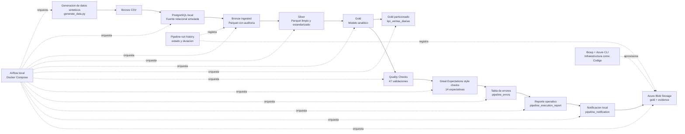

# Architecture

Este proyecto usa una arquitectura Medallion para organizar el procesamiento de datos en capas Bronze, Silver y Gold. Además, incorpora PostgreSQL como fuente relacional simulada, Apache Airflow para orquestación, Azure Blob Storage como destino cloud, validaciones de calidad, control operativo y CI/CD básico.

---

## 1. Flujo general



---

## 2. Capas de datos

### Bronze CSV

La capa Bronze inicial contiene datos fuente generados de forma sintetica en formato CSV.

Tablas fuente:

```text
MSTR_PROVEEDORES
MSTR_ARTICULOS
MSTR_TIENDAS
CRM_MIEMBROS
TRANS_VENTAS
INV_STOCK_DIARIO
POST_DEVOLUCIONES
```

Ruta local:

```text
data/bronze/
```

---

### PostgreSQL local

PostgreSQL se usa como fuente relacional simulada. Las tablas Bronze CSV se cargan a PostgreSQL para representar un sistema origen relacional.

Modulo:

```text
src/load_to_postgres.py
```

Evidencia:

```text
docs/evidence/postgres_counts_summary.txt
```

---

### Bronze ingested

Desde PostgreSQL se ingesta la informacion hacia una nueva salida Bronze en Parquet, agregando metadatos de auditoria.

Modulo:

```text
src/bronze_ingestion.py
```

Columnas de auditoria:

```text
ingestion_timestamp
source_system
batch_id
```

Ruta local:

```text
data/bronze_ingested/
```

Evidencia:

```text
docs/evidence/bronze_ingestion_log.txt
```

---

### Silver

La capa Silver contiene datos limpios, tipados y estandarizados. En esta etapa se aplican conversiones de fechas, normalizacion de textos, tratamiento de categorias y reglas de consistencia.

Modulo:

```text
src/silver_transform.py
```

Ruta local:

```text
data/silver/
```

---

### Gold

La capa Gold contiene el modelo analitico final con dimensiones, hechos y KPIs.

Modulo:

```text
src/gold_transform.py
```

Tablas principales:

```text
dim_productos
dim_tiendas
dim_clientes
fact_ventas
fact_inventario
fact_devoluciones
fact_rfm_clientes
kpi_ventas_diarias
kpi_top_articulos_categoria
```

Ruta local:

```text
data/gold/
```

---

### Gold particionado

Se genera una salida particionada de `kpi_ventas_diarias` por año y mes para simular una optimizacion de consumo analitico.

Modulo:

```text
src/create_partitioned_outputs.py
```

Ruta local:

```text
data/gold_partitioned/kpi_ventas_diarias/
```

Evidencia:

```text
docs/evidence/partitioned_outputs_summary.txt
```

---

## 3. Orquestacion

La orquestacion se realiza con Apache Airflow ejecutado localmente mediante Docker Compose.

Archivos principales:

```text
orchestration/docker-compose.yaml
orchestration/Dockerfile
orchestration/dags/retailmax_medallion_dag.py
orchestration/.env.example
```

Flujo final del DAG:

```text
start
  -> register_pipeline_start
  -> generate_bronze_data
  -> load_bronze_to_postgres
  -> ingest_postgres_to_bronze
  -> run_silver_transformations
  -> run_gold_transformations
  -> create_partitioned_gold_outputs
  -> run_quality_checks
  -> run_great_expectations_checks
  -> generate_pipeline_error_table
  -> generate_execution_report
  -> generate_pipeline_notification
  -> upload_outputs_to_azure
  -> register_pipeline_end
  -> end
```

El DAG incluye:

* dependencias explicitas;
* reintentos por tarea;
* backoff exponencial;
* timeout de ejecucion;
* ejecucion programada diaria;
* variables de entorno para PostgreSQL y Azure;
* registro de inicio y fin de ejecucion.

---

## 4. Calidad de datos

La calidad se divide en dos capas.

### Validaciones personalizadas

Modulo:

```text
src/quality_checks.py
```

Valida:

* existencia de archivos Bronze, Silver y Gold;
* volumenes minimos;
* conteos esperados;
* integridad referencial;
* cliente anonimo;
* venta neta no negativa;
* cobertura de inventario;
* alertas de quiebre;
* tasas de devolucion;
* scores RFM.

Evidencia:

```text
docs/evidence/quality_checks_summary.txt
```

Resultado esperado:

```text
47 validaciones exitosas
0 validaciones fallidas
```

---

### Validaciones estilo Great Expectations

Modulo:

```text
src/great_expectations_checks.py
```

Evalua expectations formales sobre tablas Gold, como:

* valores no nulos;
* unicidad;
* rangos numericos;
* dominios categoricos permitidos.

Evidencias:

```text
docs/evidence/great_expectations_summary.csv
docs/evidence/great_expectations_summary.txt
```

Resultado esperado:

```text
14 expectations exitosas
0 expectations fallidas
```

---

## 5. Manejo de errores

El pipeline genera una tabla de errores operativos a partir de validaciones sobre salidas Gold.

Modulo:

```text
src/error_handling.py
```

Salidas:

```text
data/errors/pipeline_errors.parquet
docs/evidence/pipeline_errors.csv
docs/evidence/pipeline_errors_summary.txt
```

Cuando no se detectan errores criticos, se registra un evento informativo:

```text
NO_ERRORS_DETECTED
severity: info
```

---

## 6. Observabilidad operativa

El proyecto genera evidencias operativas para monitorear el pipeline.

### Reporte consolidado

Modulo:

```text
src/execution_report.py
```

Salida:

```text
docs/evidence/pipeline_execution_report.txt
```

Resume:

* carga PostgreSQL;
* ingesta Bronze;
* particionamiento Gold;
* validaciones personalizadas;
* validations estilo Great Expectations;
* tabla de errores.

---

### Notificacion local

Modulo:

```text
src/notifications.py
```

Salida:

```text
docs/evidence/pipeline_notification.txt
```

Resume:

* estado del pipeline;
* estado de calidad;
* errores detectados;
* referencia al reporte operativo.

---

### Historial de ejecuciones

Modulo:

```text
src/pipeline_state.py
```

Salidas:

```text
data/control/pipeline_run_history.parquet
docs/evidence/pipeline_run_history.csv
docs/evidence/pipeline_run_history_summary.txt
```

Registra:

* `run_id`;
* estado del pipeline;
* hora de inicio;
* hora de cierre;
* duracion;
* tablas procesadas;
* registros procesados;
* orquestador.

---

## 7. Azure Blob Storage

Azure Blob Storage funciona como destino cloud para salidas Gold y evidencias.

Modulo:

```text
src/upload_to_azure.py
```

Contenedores usados:

```text
gold
evidence
```

Evidencias:

```text
docs/evidence/azure_upload_manifest.csv
docs/evidence/azure_upload_summary.txt
```

La autenticacion se realiza mediante variable de entorno:

```text
AZURE_STORAGE_CONNECTION_STRING
```

Esta variable se configura localmente o en `orchestration/.env`, pero no se versiona.

---

## 8. Infraestructura cloud

Se agrego una base de Infraestructura como Codigo con Bicep.

Archivos:

```text
infra/main.bicep
infra/parameters.dev.json
infra/README.md
```

Recursos contemplados:

* Storage Account;
* contenedores de datos y evidencias;
* Key Vault;
* Log Analytics Workspace;
* Action Group.

Esta infraestructura representa una base funcional para evolucionar el proyecto hacia un ambiente cloud mas completo.

---

## 9. CI y pruebas

El repositorio incluye validaciones automatizadas con GitHub Actions.

Workflow:

```text
.github/workflows/ci.yml
```

Valida:

* instalacion de dependencias;
* Ruff;
* pytest;
* imports principales.

Pruebas unitarias:

```text
tests/
```

Cubren modulos como:

* errores del pipeline;
* particionamiento Gold;
* validaciones formales;
* notificaciones;
* control de ejecuciones;
* carga simulada a Azure.

---

## 10. Consideraciones de diseno

Decisiones principales:

* usar arquitectura Medallion para separar datos crudos, limpios y analiticos;
* simular una fuente relacional con PostgreSQL local;
* agregar auditoria en la ingesta Bronze;
* mantener salidas locales reproducibles;
* usar Airflow local para demostrar orquestacion;
* subir solo salidas Gold y evidencias a Azure Blob Storage;
* manejar secretos mediante variables de entorno;
* no versionar datos generados ni archivos `.env`;
* agregar pruebas unitarias para reducir riesgo de regresiones.

---

## 11. Limitaciones actuales

* El procesamiento opera en modo batch/full refresh.
* No existe incrementalidad real por watermark.
* Airflow corre localmente con Docker Compose.
* Las notificaciones se generan como archivo local, no se envian a correo, Teams o Slack.
* Key Vault esta contemplado como recurso base, pero no integrado al runtime.
* Great Expectations se usa como estilo de validacion formal, pero no como Data Context completo.
* La infraestructura Bicep es una base funcional, no una plataforma multiambiente productiva.

```
```
