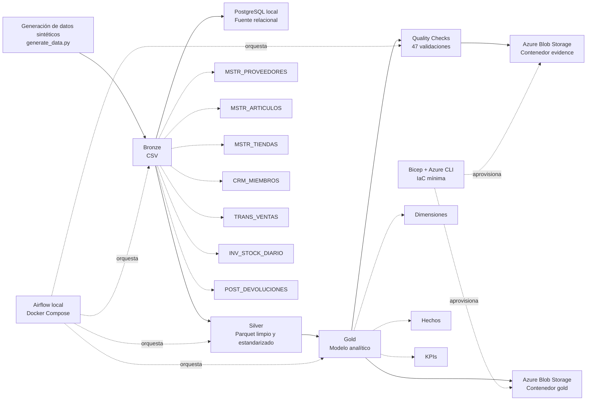

# Architecture

Este proyecto usa una arquitectura Medallion para organizar el procesamiento de datos en capas Bronze, Silver y Gold.

## Flujo general



## Componentes principales

| Componente         | Uso                                                           |
| ------------------ | ------------------------------------------------------------- |
| Python             | Generación, transformación y validación de datos.             |
| PostgreSQL local   | Simulación de una fuente relacional para las tablas Bronze.   |
| Bronze             | Datos fuente generados en CSV.                                |
| Silver             | Datos limpios, tipados y estandarizados en Parquet.           |
| Gold               | Modelo analítico con dimensiones, hechos y KPIs.              |
| Quality Checks     | Validaciones de integridad, reglas de negocio y consistencia. |
| Azure Blob Storage | Almacenamiento de evidencias y salidas analíticas.            |
| Bicep              | Infraestructura como Código mínima para recursos Azure.       |
| Airflow local      | Orquestación del flujo mediante Docker Compose.               |

## Orquestación

La ejecución principal puede realizarse de forma local con:

```powershell
python main.py
```

También se agregó una ejecución local con Apache Airflow usando Docker Compose. El DAG ejecuta el flujo:

```text
start → generate_bronze_data → run_silver_transformations → run_gold_transformations → run_quality_checks → end
```

Las evidencias de Airflow se encuentran en:

```text
docs/evidence/airflow_dag_success.png
docs/evidence/airflow_dag_graph_success.png
```

## Infraestructura cloud

Azure Blob Storage se usa como una versión simplificada de data lake para guardar:

* salidas Gold en formato Parquet;
* reportes de calidad;
* evidencias de ejecución;
* capturas de infraestructura.

Además, se agregó una versión mínima de IaC con Bicep para aprovisionar Storage Account, contenedores, Key Vault, Log Analytics y Action Group en un Resource Group de prueba.
