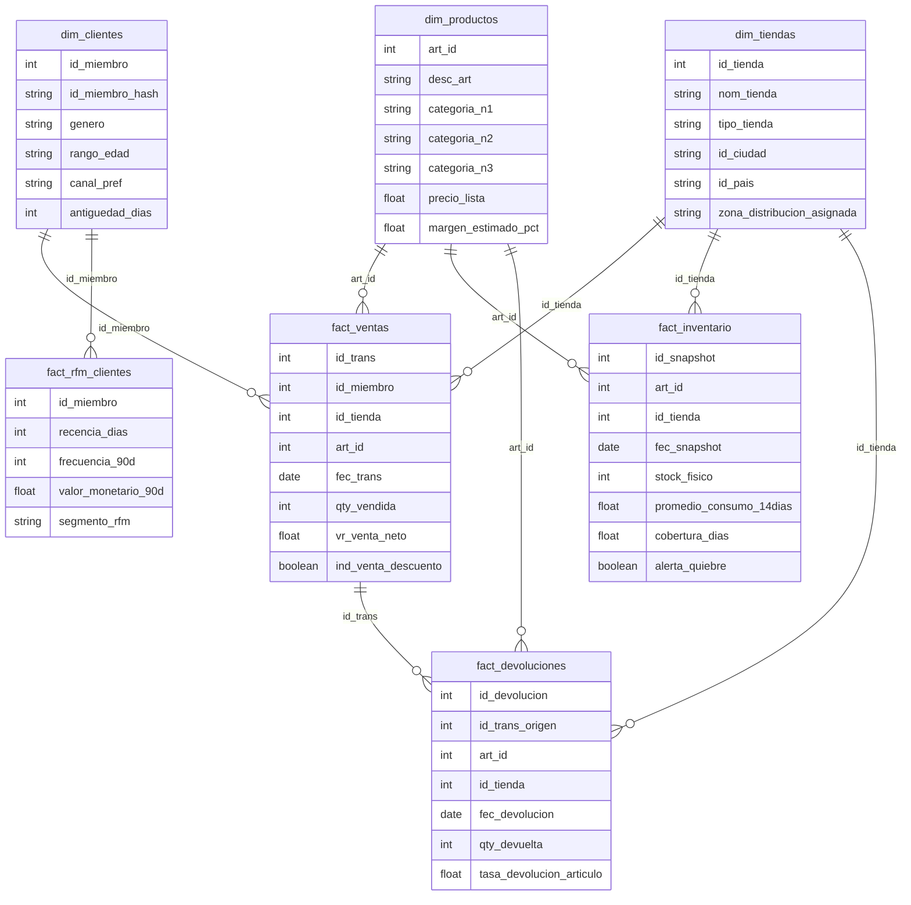

# Data Model

La capa Gold contiene dimensiones, tablas de hechos y salidas KPI para análisis.

## Salidas KPI

Además del modelo dimensional principal, la capa Gold genera dos salidas analíticas agregadas:

| Tabla | Descripción | Uso |
|---|---|---|
| `kpi_ventas_diarias` | Ventas agregadas por fecha, país, canal y categoría. | Seguimiento diario de ventas y análisis ejecutivo. |
| `kpi_top_articulos_categoria` | Top 10 artículos por categoría según ventas. | Identificar productos principales por categoría. |

Estas tablas se generan a partir de `fact_ventas` y dimensiones relacionadas. No se incluyen como entidades principales del diagrama ER porque son salidas agregadas para consumo analítico.